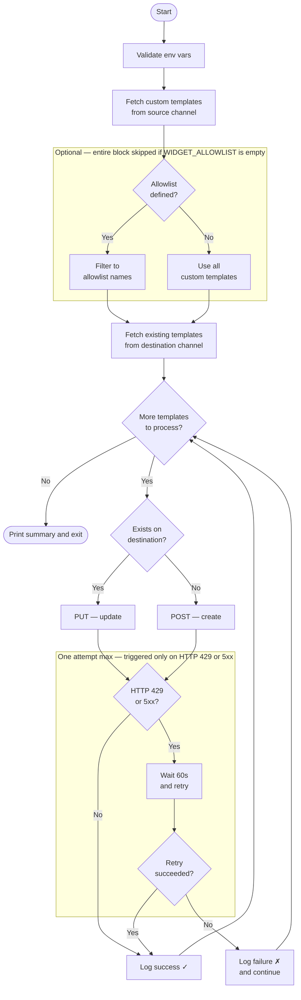

# BigCommerce Data Migration

A growing collection of Node.js scripts for migrating data between BigCommerce stores and channels. Built to be run on demand whenever data needs to be moved — each migration type lives in its own subfolder so the repo stays organised as it expands.

> This project was built with the assistance of [Claude](https://claude.ai) by Anthropic.

---

## Prerequisites

- **Node.js 18 or higher** — scripts use the native `fetch` API introduced in Node 18, so no HTTP library is required.
- A BigCommerce **Store-Level API Account** with at minimum **Content → Read/Write** scope. Create one under _Settings → API Accounts_ in your store's control panel.

---

## Getting Started

### 1. Install dependencies

```bash
npm install
```

This only needs to be done once (or again after pulling new changes).

### 2. Set up your environment file

Copy `.env.example` to a new file named `.env` at the project root:

```bash
cp .env.example .env
```

Then fill in your values:

| Variable | Description |
|---|---|
| `STORE_HASH` | Your store's unique hash — visible in the control panel URL (`mystore.mybigcommerce.com/manage`) |
| `AUTH_TOKEN` | The `X-Auth-Token` from your Store-Level API Account |
| `SOURCE_CHANNEL_ID` | Channel ID you want to copy data **from** (your main channel is typically `1`) |
| `DEST_CHANNEL_ID` | Channel ID you want to copy data **into** |

> **Important:** `.env` is listed in `.gitignore` and must never be committed to source control. It contains credentials that grant write access to your store.

Channel IDs can be found under _Channel Manager_ in the control panel, or by calling `GET /v3/channels` with your auth token.

---

## Usage

### Recommended migration order

If migrating both widget templates and web pages, always run widgets first:

```bash
npm run migrate:widgets:dry   # preview — no changes made
npm run migrate:widgets       # live run

npm run migrate:pages:dry     # preview — no changes made
npm run migrate:pages         # live run
```

Widget templates must exist on the destination channel before the web page migration runs, because the page migration builds a UUID translation map from widget template names to remap widget references inside each page's Page Builder layout.

### Always do a dry run first

Before any live migration, use the dry-run command to preview exactly what will be created or updated — without touching the API:

```bash
npm run migrate:widgets:dry
npm run migrate:pages:dry
```

The output shows every item that _would_ be created (`+`) or updated (`↻`), along with a final count.

### Migrating a single item first

Both scripts support an optional allowlist. Open the script and populate the array with the name(s) you want to test before running the full batch:

```js
// widgets/migrate-widget-templates.js
const WIDGET_ALLOWLIST = ['Hero Banner'];

// web-pages/migrate-web-pages.js
const PAGE_ALLOWLIST = ['Return Policy'];
```

Leave the array empty (`[]`) to migrate everything.

---

## Migration Flow



---

## Rate Limiting and Retries

All API calls are routed through a central `apiFetch` wrapper in `lib/api.js` that does two things:

**Rate limiting** — a minimum of one second is enforced between every API call. If a call completes faster than that, the script pauses for the remainder before proceeding.

**Automatic retry** — if a call returns HTTP `429` (Too Many Requests) or any `5xx` server error, the script logs a warning, waits 60 seconds, and retries the call once automatically. If the retry also fails, the error is logged and the script moves on to the next item rather than aborting the entire run.

---

## Available Scripts

| Command | Description |
|---|---|
| `npm run migrate:widgets:dry` | Preview widget template migration (no changes made) |
| `npm run migrate:widgets` | Run widget template migration live |
| `npm run migrate:pages:dry` | Preview web page migration (no changes made) |
| `npm run migrate:pages` | Run web page migration live |

---

## Project Structure

```
bigcommerce-data-migration/
├── .env.example                     # Template for required environment variables
├── .env                             # Your local credentials (gitignored)
├── package.json
├── lib/
│   └── api.js                       # Shared API client factory (rate limiting, retry)
├── widgets/
│   └── migrate-widget-templates.js  # Widget template migration
└── web-pages/
    └── migrate-web-pages.js         # Web page + Page Builder layout migration
```

New migration types (products, customers, etc.) follow the same pattern: add a subfolder, import `createApiClient` from `lib/api.js`, and add a corresponding `npm run migrate:<type>` script in `package.json`.

---

## Known Limitations

### Web page migration (`migrate:pages`)

The web page migration script is **functional but incomplete**. The following items are known gaps to address in a future pass:

- **Navigation order / page hierarchy**: Pages are copied in `sort_order` from the source, but the destination channel may not reflect the correct navigation order or parent–child nesting. Manual reordering in the BigCommerce control panel is likely needed after migration.

- **Parent–child sort order bug**: The script builds a `source_id → dest_id` map as it processes pages in `sort_order` order. In stores where children have a lower `sort_order` than their parent, the child is processed before the parent is mapped, and `parent_id` defaults to `0`. A proper fix requires topological sorting of the page list before the upsert loop. Re-running the script a second time resolves most cases since all pages exist on the destination by then.

- **`PAGE_TEMPLATE_FILE` constant**: The Page Builder widget API requires a `template_file` parameter, but the Pages API does not return this field. The constant at the top of `migrate-web-pages.js` is hardcoded to `pages/page` (the Cornerstone theme default). Stores on a different Stencil theme may need to update this value to match their theme's actual template file name for custom pages.

- **Blog pages skipped**: BigCommerce does not allow creating blog pages via the API. Any blog pages on the source channel are logged and skipped — they must be manually recreated on the destination.

- **`link` type pages**: Pages of type `link` (external URL redirects) require a `link` field in the API payload. This is handled in the script but has had limited real-world testing — verify these pages on the destination after migration.

---

## API Documentation

- [Widget Templates](https://docs.bigcommerce.com/developer/api-reference/rest/admin/content/widgets)
- [Web Pages](https://docs.bigcommerce.com/developer/api-reference/rest/admin/content/pages)
- [Page Widgets (Page Builder)](https://docs.bigcommerce.com/developer/api-reference/rest/admin/content/page-widgets)
